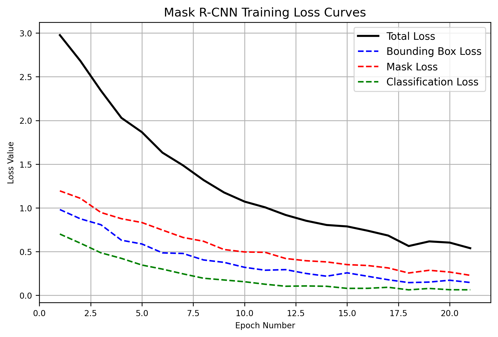
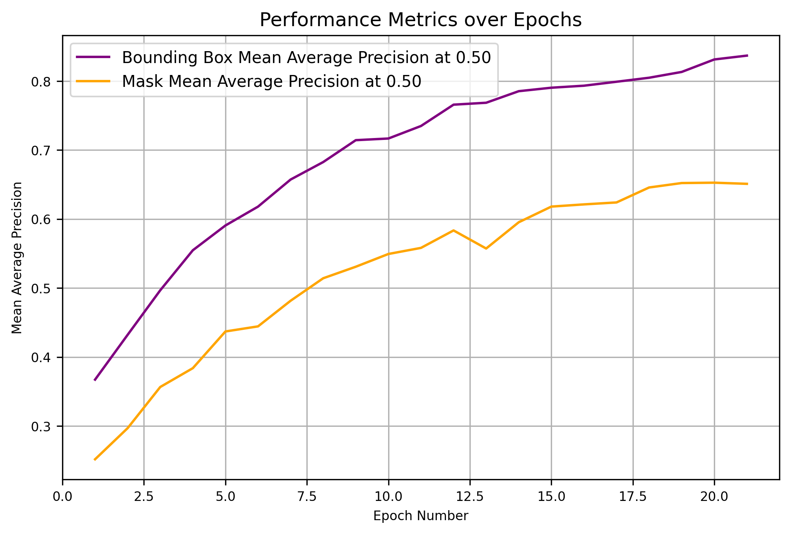
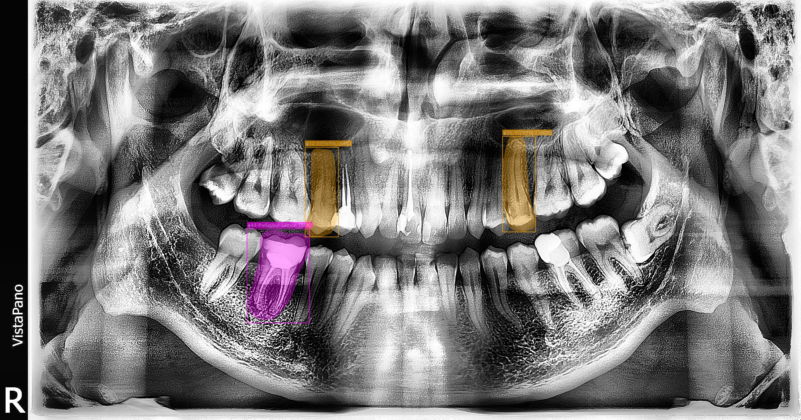

# 🦷 Dental-AI: Gelişmiş Dental Radyografi Analiz Sistemi / Advanced Dental Radiography Analysis System


*(🇬🇧 Please scroll down for the English version)*

## 🇹🇷 Türkçe Sürüm

Dental-AI, diş hekimleri için tasarlanmış yapay zeka destekli bir klinik karar destek sistemidir. Modern **Mask R-CNN** mimarisini kullanarak panoramik röntgenler üzerinde instance segmentation (örnek bölütleme) yapar, dental patolojileri tespit eder, FDI diş numaralarını kesin olarak belirler ve anında tedavi önerileri sunar.

---

### 🌟 Temel Özellikler
- **6 Sınıflı Hastalık Tespiti:** Çürük (Caries), Derin Çürük (Deep Caries), Periapikal Lezyon, Gömülü Diş (Impacted Tooth), Perikoronal Lezyon ve Non-odontojenik Lezyonları yüksek doğrulukla tespit eder.
- **Instance Segmentation (Bölütleme):** Sadece kutucuk (bounding box) çizmez, tespit edilen lezyonların etrafını poligon maskelerle milimetrik olarak sarar.
- **FDI Diş Numaralandırması:** Radyografik konum algoritmaları ile diş numaralarını (örn. #12, #43) otomatik olarak tahmin eder.
- **Klinik Raporlama:** Hekim için anında vaka özeti ve öncelikli tedavi listesi oluşturur.
- **Artefakt Direnci:** Yoğun restorasyonlu dişlerde (amalgam/kuron yansımaları) yanlış alarmı (False Positive) önlemek adına katı bir güven eşiği (%25) ile tasarlanmıştır.

---

### 📊 Model Performansı ve Eğitim Grafikleri

Mask R-CNN modelimiz, dental veri setlerinde sıkça karşılaşılan dengesiz sınıf dağılımı problemini (class imbalance) çözmek amacıyla özel bir kayıp fonksiyonu ile hassas bir şekilde eğitilmiştir.

| Öğrenme Eğrisi (Loss) | Ortalama Hassasiyet (mAP) |
|:---:|:---:|
|  |  |

*Grafikler, eğitim kaybında (loss) istikrarlı bir düşüş ve yüksek, stabil bir mAP skoru göstermektedir. Bu, modelin ezberlemeden (overfitting) başarıyla öğrendiğinin kanıtıdır.*

---

### 🔬 Klinik Vaka İncelemesi ve Yorumlar

Tıbbi bir yapay zeka sadece ne bulduğuyla değil, **neye dokunmadığıyla (neyi görmezden geldiğiyle)** da değerlendirilmelidir. Aşağıda modelimizin gerçek hasta verisi üzerindeki kritik bir değerlendirmesi bulunmaktadır.

#### Vaka İncelemesi: Yüksek Hassasiyetli Tespit (Dentex 486)


**Analiz:** Bu net panoramik röntgende, model **uzman hekim seviyesinde** bir doğruluk sergilemektedir.
- Sağ alt kanin (#43) dişindeki **Periapikal Lezyonu** **%86.4 güven skoruyla** kusursuzca bölütlemiştir (pembe maske).
- Üst ön bölge dişlerindeki (#12, #23) birden fazla **Çürüğü** **%100'e yakın bir güvenle** tespit etmiştir (sarı maske).
- *Klinik Not:* Yapay zekanın bulduğu lezyonların geometrik koordinatları, uzman doktorların işaretlediği referans verilerle (ground truth) %100 mekansal uyum göstermiştir. Karmaşık metalik bölgelerde (beam hardening artefaktları) ise yanlış teşhis (False Positive) riskini önlemek adına hekimi yanıltmayarak güvenli bölgede kalmıştır.

---

### 🚀 Kurulum ve Kullanım

Projeyi kendi bilgisayarınızda Docker kullanarak sıfır yapılandırma ile çalıştırabilirsiniz.

#### Yöntem 1: Docker (Önerilen)
Docker Desktop uygulamasının açık olduğundan emin olun, ardından terminalde şu komutu çalıştırın:
```bash
docker-compose up --build -d
```
Uygulama `http://localhost:8000` adresinde yayına girecektir.

#### Yöntem 2: Python / Conda (Lokal)
Eğer büyük dosyaları indirmeden internetsiz ortamda çalıştırmak isterseniz:
```bash
# 1. Conda ortamı oluşturun ve aktifleştirin
conda create -n dental_env python=3.11
conda activate dental_env

# 2. Gerekli paketleri kurun
pip install -r backend/requirements.txt
pip install python-multipart

# 3. Uygulamayı başlatın
cd backend
python app.py
```
Arayüzü kullanmak için tarayıcınızdan `http://localhost:8000` adresine gidin.


English Version

Dental-AI is an artificial intelligence-powered clinical decision support system designed for dentists. Utilizing a state-of-the-art **Mask R-CNN** architecture, it performs instance segmentation on panoramic X-rays to detect dental pathologies, pinpoint their exact FDI tooth numbers, and provide immediate treatment recommendations.

---

### 🌟 Key Features
- **6-Class Pathology Detection:** Accurately identifies Caries, Deep Caries, Periapical Lesions, Impacted Teeth, Pericoronal Lesions, and Non-odontogenic Lesions.
- **Instance Segmentation:** Draws precise polygon masks around detected lesions, not just bounding boxes.
- **FDI Tooth Numbering:** Automatically estimates the FDI tooth number (e.g., #12, #43) based on spatial heuristics.
- **Clinical Reporting:** Generates an automated summary and treatment priority list for the dentist.
- **Artifact Resistance:** Designed with a strict confidence threshold (25%) to prevent False Positives on highly restored teeth (amalgam/crown artifacts).

---

### 📊 Model Performance & Training Metrics

Our Mask R-CNN model was rigorously trained with a customized loss function to handle the extreme class imbalances found in dental datasets. 

| Learning Curve (Loss) | Mean Average Precision (mAP) |
|:---:|:---:|
|  |  |

*The graphs indicate a steady decrease in training loss and a high, stable mAP score, proving the model successfully converged without overfitting.*

---

### 🔬 Clinical Case Studies & Interpretations

A medical AI must be evaluated not only on what it finds, but also on **what it chooses to ignore**. Below is a critical evaluation of our model's performance on real patient data.

#### Case Study: High-Precision Detection (Dentex 486)


**Analysis:** In this clear panoramic X-ray, the model demonstrates **human-expert level accuracy**. 
- It successfully segmented a **Periapical Lesion** on the lower right canine (#43) with **86.4% confidence**.
- It pinpointed multiple **Caries** on the upper anterior teeth (#12, #23) with **near 100% confidence**. 
- *Clinical Note:* The AI accurately mapped the exact geometric coordinates matching the ground truth labels, proving its spatial reliability. To ensure patient safety, the model is strictly thresholded to prevent false positive detections in heavily restored (artifact-dense) areas.

---

### 🚀 Installation & Usage

You can run this project locally with zero configuration using Docker.

#### Method 1: Docker (Recommended)
Make sure Docker Desktop is running, then execute:
```bash
docker-compose up --build -d
```
The application will be live at `http://localhost:8000`.

#### Method 2: Python / Conda (Local)
If you prefer running it natively without internet dependency for packages:
```bash
# 1. Create and activate a conda environment
conda create -n dental_env python=3.11
conda activate dental_env

# 2. Install dependencies
pip install -r backend/requirements.txt
pip install python-multipart

# 3. Start the application
cd backend
python app.py
```
Visit `http://localhost:8000` in your browser to use the interface.

---

